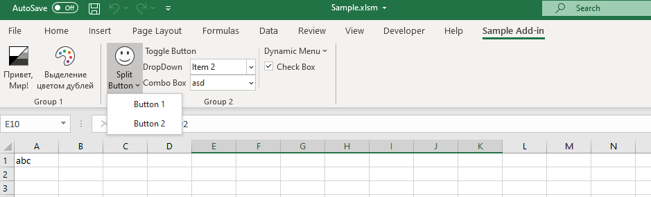

# SampleExcelXlamAddin
MS Excel sample VBA Add-in with custom ribbon tab

Here is sample of MS Excel workbook, that contains basic examples of Ribbon controls



Here is customUI.xml contents to build this ribbon tab:

```xml
<?xml version="1.0" encoding="utf-8"?>
<customUI xmlns="http://schemas.microsoft.com/office/2006/01/customui">
  <ribbon>
    <tabs>
      <tab id="customTab" label="Sample Add-in" keytip="XT">
        <group id="Tools" label="Group 1">
          <button id="HelloWorldBtn" imageMso="BlackAndWhiteAutomatic" keytip="H" label="Привет, Мир!"
            onAction="SayHelloWorld" screentip="Поприветствовать мир" size="large" />
          <button id="DuplicatesBtn" imageMso="SmartArtChangeColorsGallery" keytip="D"
            label="Выделение цветом дублей" onAction="DuplicateColors"
            screentip="Выделение парными цветами повторов в выделенном диапазоне" size="large" />
        </group>
        <group id="SampleControls" label="Group 2">
          <splitButton id="splitButton" size="large" >
            <button id="SplitButton" imageMso="HappyFace" label="Split Button" />
            <menu id="menu">
              <button id="button1" label="Button 1" onAction="OnSplitButton1Click" />
              <button id="button2" label="Button 2" onAction="OnSplitButton2Click" />
            </menu>
          </splitButton>
          <toggleButton id="ToggleButton" label="Toggle Button" onAction="OnToggleButtonClick" />
          <dropDown id="DropDown" label="DropDown" onAction="OnDropDownSelected" >
            <item id="DropDownItem1" label="Item 1" />
            <item id="DropDownItem2" label="Item 2" />
            <item id="DropDownItem3" label="Item 3" />
            <button id="button" label="Button..." />
          </dropDown>
          <comboBox id="ComboBox" label="Combo Box" onChange="OnComboBoxSelected" >
            <item id="ComboBoxItem1" label="Item 1" />
            <item id="ComboBoxItem2" label="Item 2" />
            <item id="ComboBoxItem3" label="Item 3" />
          </comboBox>
          <separator id="separator" />
          <dynamicMenu id="DynamicMenu" label="Dynamic Menu" getContent="GetMenuContent" />
          <checkBox id="CheckBox" label="Check Box" onAction="OnCheckBoxToggled" />
        </group>
      </tab>
    </tabs>
  </ribbon>
</customUI>
```
